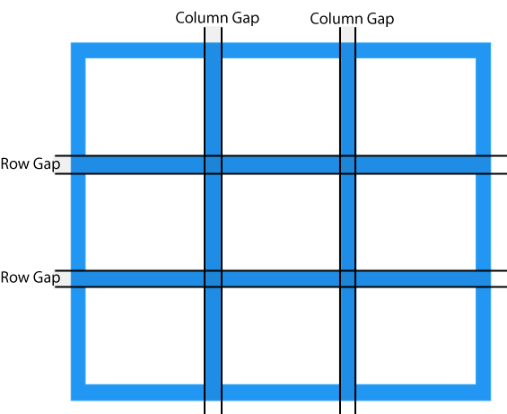

# basic concept
## translatenél mit jelentenek az értékek
```css
@keyframes slide-in {
  from {
    translate: 150vw 0;
    scale: 200% 1;
  }

  to {
    translate: 0 0;
    scale: 100% 1;
  }
}
```
- from:
    1. translate: 150vw 0;
        - Az elem 150vw‑vel jobbra van tolva.
        - A vw = viewport width → a képernyő szélességének 1%-a.
        - 150vw = másfélszer a képernyő szélessége.
    2. scale: 200% 1;
        - Az elem kétszer olyan széles, mint normálisan.
        - A magassága változatlan (1).
- to:
    1. translate: 0 0;
        - Az elem visszakerül az eredeti helyére.
    2. scale: 100% 1;
        - Az elem szélessége visszaáll normál méretre.

[html](using_css_animations/using_css_animations.html) <br>
[css](using_css_animations/using_css_animations.css)


## ainmáció százalélok hogy vannak sorban
```css
@keyframes grow-shrink {
  25%,
  75% {
    scale: 100%;
  }

  50% {
    scale: 200%;
    color: magenta;
  }
}
```
A százalékok sorrendje nem számít, a böngésző:
- beolvas
- százalék szerint sorba rendez
- kiszámolja a köztes állapotokat

Így a folymat:
- 0% → 25%: 100% → 100% (nem változik)
- 25% → 50%: 100% → 200% (növekszik)
- 50% → 75%: 200% → 100% (zsugorodik)
- 75% → 100%: 100% → 100% (nem változik)

Ha töröljük a 25%-ot:
- 0% → 50%: 100% → 200% (folyamatos növekedés)
- 50% → 75%: 200% → 100% (zsugorodik)
- 75% → 100%: 100% → 100% (nem változik)

[html](using_css_animations/using_css_animations.html) <br>
[css](using_css_animations/using_css_animations.css)

## tartsa meg a színt a végén
Az animáció után az elem visszaáll az eredeti stílusára, hacsak nem mondod neki, hogy tartsa meg az animáció utolsó állapotát.<br>
Erre való az: **animation-fill-mode: forwards**<br>
Ez azt jelenti: Az animáció befejezése után maradj úgy, ahogy az utolsó keyframe-ben vagy.


[html](using_css_animations/using_css_animations.html) <br>
[css](using_css_animations/using_css_animations.css)

## láthatatlan legyen az elem de tartsa meg a helyét
[Példák és leírás](.plusz/invisible_keeps_space.html)

## mértékegységek, reszponzivitás
https://css-tricks.com/css-length-units/

[Példák és leírás](css_length_units/css_length_units.html)

## media querinél csinálni példát, hogy mikor vált át
https://css-tricks.com/a-complete-guide-to-css-media-queries/

[Példák és leírás](using_media_queries/using_media_queries.html)

# inheritance
## Inherited Properties
Inherited properties are, by default, set to the computed value of the parent element.

## Non-inherited Properties
If there is not set a value for a non-inherited property, the value is set to the initial (default) value of that property.

## The inherit Keyword
The inherit keyword is used to explicitly specify inheritance. It works on both inherited and non-inherited properties.

[Példák és leírás](.plusz/../inheritance/inheritance.html)

# hierarchy css (Specificity)
CSS specificity is an algorithm that determines which style declaration is ultimately applied to an element. <br>
If two or more CSS rules point to the same element, the declaration with the highest specificity will "win", and that style will be applied to the HTML element.

erre van calculator: https://specificity.keegan.st/

[Példák és leírás](.plusz/../specificity/specificity.html)

# selectors
https://css-tricks.com/css-selectors/

## Common Selectors
```css
/* Universal */
* {
  box-sizing: border-box;
}

/* Type or Tag */
p {
  margin-block: 1.5rem;
}

/* Classname */
.class {
  text-decoration: underline;
}

/* ID */
#id {
  font-family: monospace;
}

/* Relational */
li:has(a) {
  display: flex;
}
```

## Common Combinators
```css
/* Descendant */
header h1 {
  /* Selects all Heading 1 elements in a Header element. */
}

/* Child */
header > h1 {
  /* Selects all Heading 1 elements that are children of Header elements. */
}

/* General sibling */
h1 ~ p {
  /* Selects a Paragraph as long as it follows a Heading 1. */
}

/* Adjacent sibling */
h1 + p {
  /* Selects a Paragraph if it immediately follows a Heading 1 */
}

/* Chained */
h1, p { 
  /* Selects both elements. */
}
```
[Példák és leírás](.plusz/../selectors/selectors.html) <br>
[Példák és leírás](.plusz/../selectors/selectors2.html)


# flex layout
https://css-tricks.com/snippets/css/a-guide-to-flexbox/

[Példák és leírás](.plusz/../flex_layout/flex_layout.html)

# grid layout
https://css-tricks.com/complete-guide-css-grid-layout/
### Grid vs. Flexbox
- CSS Grid is used for two-dimensional layout, with rows AND columns.
- CSS Flexbox is used for one-dimensional layout, with rows OR columns.,



[Példák és leírás](../grid_layout/grid_layout.html)